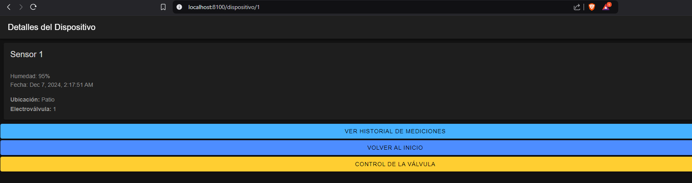
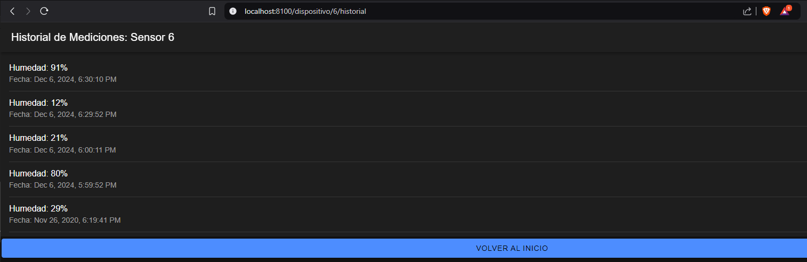
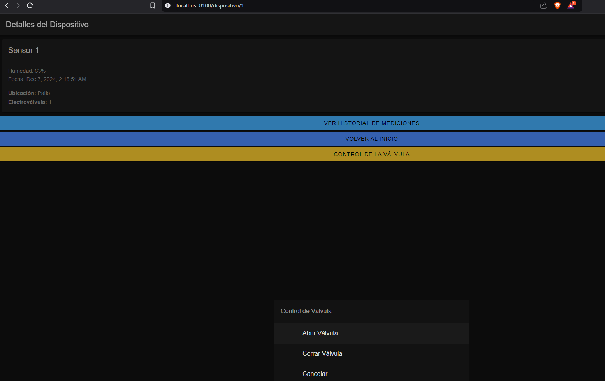

# 🌟 Proyecto de Gestión de Sensores y Electroválvulas  

  
**Materia:** Desarrollo de Aplicaciones Multiplataforma  
**Institución:** Universidad de Buenos Aires (UBA) – Especialización en IoT 

**Trabajo Práctico Final** - Eberth Alarcón

---

## 📝 Descripción  
Este proyecto es una **aplicación web interactiva** diseñada para gestionar sensores y electroválvulas. Permite:  

- Monitorear mediciones de humedad.  
- Controlar válvulas en tiempo real.  
- Mantener un historial de riegos.  
- Simular datos de sensores.  

Desarrollado con una arquitectura **Ionic + Angular** en el frontend y **Node.js + MySQL** en el backend, esta solución combina interactividad y eficiencia para aplicaciones de IoT.  

---

## 🚀 Características Principales  

### 🛠️ Gestión de Sensores y Válvulas  
- Consulta detallada de dispositivos (sensores).  
- Historial de mediciones organizadas cronológicamente.  
- Control de válvulas: abrir/cerrar con registro automático.  

### 📊 Simulación de Mediciones  
- Generación automática de valores de humedad mediante `Math.random`.  

### 🎨 Interfaz Personalizada  
- Uso de componentes avanzados de **Ionic** como:  
  - Botones con íconos personalizados.  
  - Listas dinámicas e interactivas.  
  - Temas y colores intuitivos.  

### 📂 Base de Datos Relacional  
- Diseño estructurado con tablas para:  
  - `Dispositivos`.  
  - `Electroválvulas`.  
  - `Mediciones`.  
  - `Log_Riegos`.  

---

## 📂 Estructura del Proyecto  

```
📂 DAM
├── 📂 db                 # Scripts SQL para la base de datos
├── 📂 src                # Carpeta principal
│   ├── 📂 backend        # Código del servidor Node.js
│   │   ├── 📂 routes     # Rutas del servidor
│   │   ├── 📂 utils      # Funciones auxiliares (pipeline de fechas)
│   ├── 📂 frontend       # Interfaz del cliente (Ionic + Angular)
│   │   ├── 📂 app        # Componentes y servicios
│   │   ├── 📂 assets     # Recursos estáticos (imágenes, estilos, etc.)
├── README.md             # Documentación del proyecto
└── docker-compose.yml    # Configuración para contenedores Docker
```

---

## 🛠️ Configuración del Entorno  

### 1️⃣ Clonar el Repositorio  

```bash
git clone https://github.com/Eberth-sys/TP-DAM.git
cd proyecto-sensores-valvulas
```

### 2️⃣ Configuración del Backend  

```bash
cd src/backend
npm install
```

### 3️⃣ Configuración del Frontend  

```bash
cd src/frontend/dam
npm install
```

---

## ▶️ Iniciar el Proyecto  

### 1️⃣ Ejecutar el Servidor Backend  

```bash
cd DAM\DAM\app-dam\src\backend 
node index.js
```

### 2️⃣ Levantar el Frontend  

```bash
cd DAM\DAM\app-dam\src\frontend\dam>
ionic serve
```

### 3️⃣ Iniciar Servicios con Docker (Opcional)  

```bash
cd DAM\DAM\app-dam>
docker-compose up
```

---

## 🌐 Uso de la Aplicación  

### 🌟 Funcionalidades Principales  

1. **Ver la última medición de humedad**.  
   - Selecciona un sensor para obtener datos actualizados.  
     

2. **Consultar el historial de mediciones**.  
   - Explora los datos cronológicos de humedad.  
     

3. **Abrir y cerrar válvulas**.  
   - Controla el flujo de agua con un clic.  
     

4. **Registro automático en la base de datos**.  
   - Las acciones quedan almacenadas automáticamente.  

---

## 👥 Colaboradores  

| Nombre            | Rol                       |  
|-------------------|---------------------------|  
| **Eberth Alarcón** | Desarrollo completo del proyecto |  

---

## 📚 Contexto Académico  

Este proyecto forma parte de la materia **"Desarrollo de Aplicaciones Multiplataforma"**, dictada en la **Especialización en Internet de las Cosas (IoT)** de la **Universidad de Buenos Aires (UBA)**.  

### 🌟 Propósito  
- Implementar una solución de software completa para sensores y electroválvulas.  
- Explorar tecnologías modernas como **Ionic**, **Angular**, **Node.js**, y **MySQL** en un contexto IoT.  

### 👨‍🏫 Docente  
**Profesor:** Pedro Rosito  

### 🏫 Institución  
**Universidad de Buenos Aires (UBA)**  
**Facultad de Ingeniería**  
  

---

## 📄 Licencia  

Este proyecto está bajo la licencia **[MIT](https://choosealicense.com/licenses/mit/)**. Consulta el archivo [LICENSE.md](LICENSE.md) para más detalles.  

---
