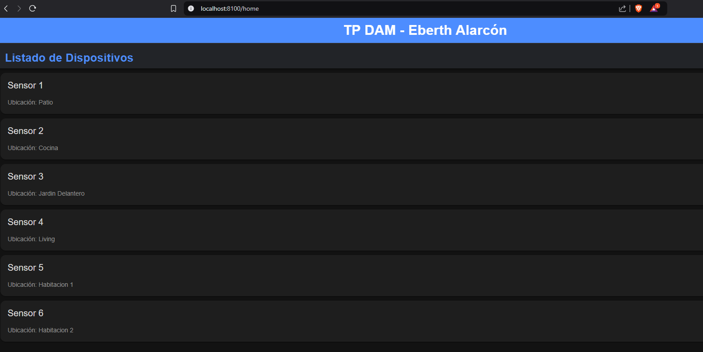
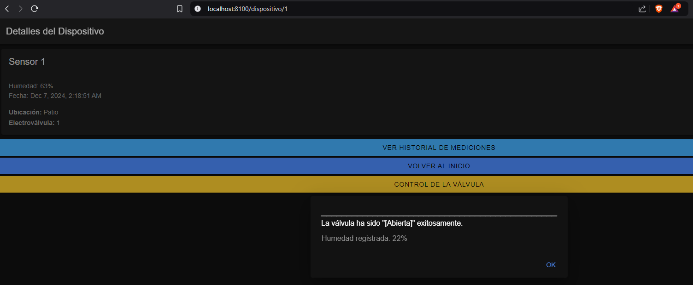

---

# 🌟 Proyecto de Gestión de Sensores y Electroválvulas para la materia de Desarrollo de Aplicaciones Móviles.


## 📝 Descripción  
Este proyecto es una **aplicación web interactiva** diseñada para gestionar sensores y electroválvulas. Incluye funciones para monitorear mediciones de humedad, realizar acciones sobre válvulas, y mantener un historial de riegos, todo con una interfaz optimizada gracias a **Ionic Components**.

---

## 🚀 Características Principales  

### 1️⃣ Gestión de Sensores y Válvulas  
- **Consulta de Dispositivos**: Lista de sensores con detalles como ubicación y electroválvula asociada.  
- **Historial de Mediciones**: Registro completo de lecturas de humedad.  
- **Apertura y Cierre de Válvulas**: Acciones de riego con registro automático en la base de datos.  

### 2️⃣ Simulación de Mediciones  
- **Generación Automática**: Simulación de valores de humedad mediante `Math.random`.  

### 3️⃣ Interfaz Personalizada  
- Uso de componentes avanzados de **Ionic** (íconos, listas interactivas, botones flotantes).  
- Feedback dinámico para acciones como apertura/cierre de válvulas.  

### 4️⃣ Base de Datos  
- Tablas bien estructuradas para `Dispositivos`, `Electroválvulas`, `Mediciones` y `Log_Riegos`.  
- Relación directa entre sensores y válvulas para un control eficiente.  

---

## 📂 Estructura del Proyecto  

```
📂 DAM
├── 📂 db                 # Scripts SQL para la base de datos
├── 📂 src                # Carpeta principal
│   ├── 📂 backend        # Código del servidor Node.js
│   │   ├── 📂 routes     # Rutas del servidor
│   │   ├── 📂 utils      # Funciones auxiliares (e.g., pipeline de fechas)
│   ├── 📂 frontend       # Interfaz del cliente (Ionic + Angular)
│   │   ├── 📂 app        # Componentes y servicios
│   │   ├── 📂 assets     # Recursos estáticos (imágenes, estilos, etc.)
├── README.md             # Documentación del proyecto
└── docker-compose.yml    # Configuración para contenedores Docker
```

---

## 🛠️ Configuración del Entorno  

### 1️⃣ Clonar el Repositorio  

git clone https://github.com/tu-usuario/proyecto-sensores-valvulas.git
cd proyecto-sensores-valvulas


### 2️⃣ Configuración del Backend  

# Navegar al directorio del backend
cd src/backend

# Instalar dependencias
npm install


### 3️⃣ Configuración del Frontend  

# Navegar al directorio del frontend
cd src/frontend/dam

# Instalar dependencias
npm install


---

## ▶️ Iniciar el Proyecto  

### 1️⃣ Ejecutar el Servidor Backend  

# Desde el directorio backend
cd src/backend
node index.js


### 2️⃣ Levantar el Frontend  

# Desde el directorio frontend
cd src/frontend/dam
ionic serve


### 3️⃣ Iniciar Servicios con Docker (Opcional)  

# Desde la raíz del proyecto
docker-compose up


---

## 🌐 Uso de la Aplicación  

### 1️⃣ Ingresar a la aplicación  
- Abre tu navegador favorito y accede a: [http://localhost:8100](http://localhost:8100).  
- Desde aquí, tendrás acceso a todas las funcionalidades de la aplicación.  


### 2️⃣ Ver la última medición de humedad  
- Selecciona un dispositivo para ver detalles como la **última medición de humedad** y la fecha en la que se registró. 

  🔍 **Visualiza información detallada del sensor:**   
   

### 3️⃣ Consultar el historial de mediciones  
- Accede al historial completo de mediciones realizadas por un sensor, ordenadas cronológicamente.  
  📊 **Revisa cómo han variado las mediciones:**  
    

### 4️⃣ Accionar las válvulas (abrir/cerrar)  
- Usa los botones para **abrir** o **cerrar la válvula** asociada al sensor.  
- Recibirás una confirmación en pantalla y el evento se registrará automáticamente en la base de datos.  
  🚰 **Controla las válvulas de forma remota:**  
   

### 5️⃣ Registro automático en la base de datos  
- Cada acción realizada (abrir/cerrar válvulas o registrar una medición) se almacena automáticamente en la base de datos.  
  📂 **Consulta los registros en cualquier momento:**   
   

---

### 🚀 ¡Listo para usar!  
Explora, experimenta y disfruta de la gestión de tus sensores y válvulas en tiempo real con esta herramienta interactiva.


---

## 👥 Colaboradores  

| Nombre            | Rol                       |  
|-------------------|---------------------------|  
| **Eberth Alarcón** | Desarrollo completo del proyecto |  

---

## 📚 Contexto Académico  

Este proyecto fue desarrollado como parte de la materia **"Desarrollo de Aplicaciones Multiplataforma"**, correspondiente a la **Especialización en Internet de las Cosas (IoT)** de la **Universidad de Buenos Aires (UBA), Argentina**.  

### Propósito  
La finalidad del proyecto es implementar una solución funcional para el control y monitoreo de sensores y electroválvulas, integrando conceptos avanzados de desarrollo de software para IoT:  

- **Frontend interactivo y adaptable** con **Ionic** y **Angular**.  
- **Backend eficiente** basado en **Node.js** con conexión a una base de datos relacional **MySQL**.  
- **Simulación de datos** para sensores de humedad, combinada con operaciones en tiempo real.  

### Docente  
**Profesor:** Pedro Rosito  

### Institución  
**Universidad de Buenos Aires (UBA)**  
**Facultad de Ingeniería**  

---

## 📄 Licencia  

Este proyecto está bajo la licencia **[MIT](https://choosealicense.com/licenses/mit/)**. Consulta el archivo [LICENSE.md](LICENSE.md) para más detalles.  

--- 
